# Static Site Documentation

### Warning
If you reading this you must have came from the [first]() repository after building the electonics and cloud infrusture. If you not created the electronic step or cloud infrusture yet, please go back to the [first]() repository and complete the steps leading up to this point. 

## Summary

This repository is built for the React serverlesss site we are going to host on AWS Amplify. Since React can run in a moblie/web browser it make it a perfect microframe to use. I will be making a improvment to website sytling and feature in the future. The sytling is very bare minminal because I not familar with front-end development and there already so much work with the backend. Please follow the instruction below to correctly link your smart doorlock.

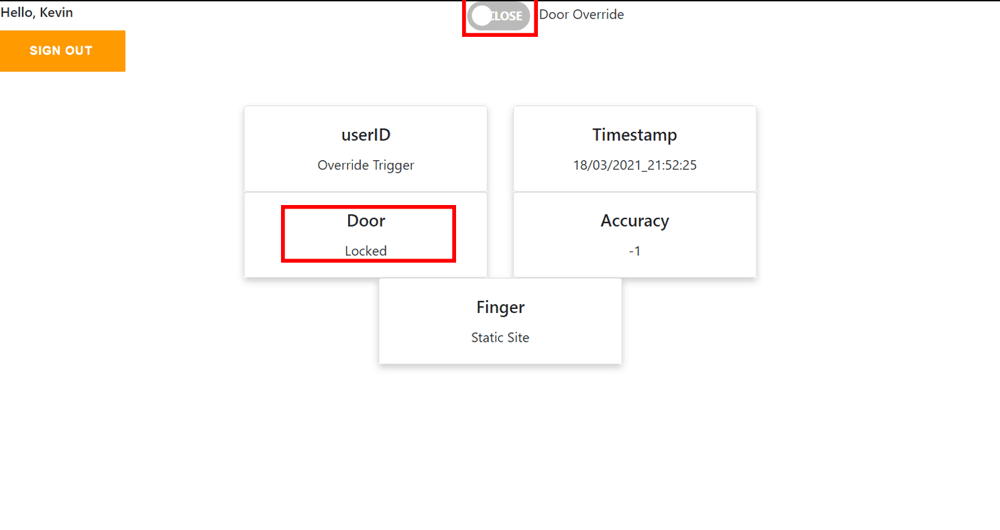

  <details>
     <summary>Click for Moblie Site Demo</summary>
         
   </details>

## Prerequisites:
- [AWS Console account](https://docs.aws.amazon.com/polly/latest/dg/setting-up.html)
- [Create-React-App](https://www.npmjs.com/package/create-react-app)
- [npm](https://www.npmjs.com/get-npm)

## Installation/Instructions
We are going to build this portion of the diagram today, please follow the step below in squencal order.</br>**Please click on any pictures/GIFs to enlarge them**

1.  <details>
     <summary>Click for General Setup Instruction</summary>
     
     ### General Setup
     1. Make sure all the prerequisites are all met and installed
     2. Clone this repo ```git clone https://github.com/KevyVo/Door_staticsite```
     3. cd into the directory alarmsite ```~/Door_staticsite/alarmsite```
     4. Install all the packages ```npm install```
     5. Once all the steps are completed move onto amplify Setup
   </details>

2.  <details>
     <summary>Click for React Setup Instruction</summary>

     We are going to enter the right aws information for your cloud service that created in the [first]() repo and change some user customication
     
     ### React Setup
     1. Please open your AWS console and navigate to AWS Iot Core
     2. The endpoint should be found here, please copy this since we will be using this shortly
        + 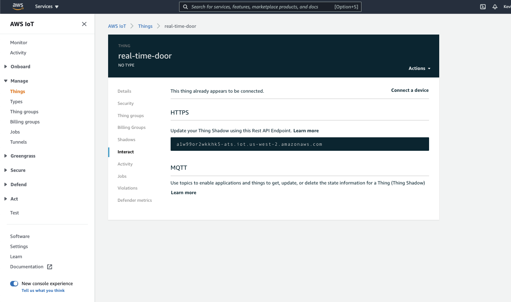
     3. Please navigate to the App.js for React,```alarmsite/src/App.js```
     4. Please change the endpoint and region here with endpoint and region
        + ```
          Amplify.addPluggable(new AWSIoTProvider({
             aws_pubsub_region: 'us-west-2',
             aws_pubsub_endpoint: 'wss://a1w99or2wkkhk5-ats.iot.us-west-2.amazonaws.com/mqtt',
            }));
          ```
     5. Now change name to your name now, localed in display-name
        + ```return authState === AuthState.SignedIn && user ? (
            <div className="App">
                <ToggleSwitch id="Override" checked={ Override } onChange={ onOverrideChange } />
            <label htmlFor="Override">Door Override</label>
            <div className="display-name">Hello, Kevin</div>
                <AmplifySignOut />
            <Container className="p-4">
                <Row className="p-3 justify-content-md-center">
                <Col md="auto"> <Sensors name="userID" unit=""/> </Col>
                <Col md="auto"> <Sensors name="Timestamp" unit=""/> </Col>
                <Col md="auto"> <Sensors name="Door" unit=""/> </Col>
                <Col md="auto"> <Sensors name="Accuracy" unit=""/> </Col>
                <Col md="auto"> <Sensors name="Finger" unit=""/> </Col>
                </Row>
            </Container>
            </div>
            ```
     6. Now save the js file
     7. Now navigate to ```alarmsite/src/components/sensorData.js```
     8. We need to change template endpoint and region to your endpoint and region once again
        + ```Amplify.addPluggable(new AWSIoTProvider({
                aws_pubsub_region: 'us-west-2',
                aws_pubsub_endpoint: 'wss://a1w99or2wkkhk5-ats.iot.us-west-2.amazonaws.com/mqtt',
            }));
          ```
     9.  Save the js file
     10. Once successful please move onto the Amplify instructions
       
   </details>

3.  <details>
     <summary>Click for Amplify Setup Instruction</summary>

     Please refer to this supporting [docmention]() if any errors occurs

     ### Amplify Setup
     1. Use the same AWS account we made for database in the [first](https://docs.amplify.aws/start/q/integration/react)
     2. Install the Amplify CLI if you have not, ```npm install -g @aws-amplify/cli```
     3. Setup add new user, ```amplify configure```
     4. Create a new user when the window popup
        + 
     5. Please download the csv or keep the page with credtional page up
     6. Please fill out the prompts on the terminal like this
        + ``` 
          Enter the access key of the newly created user:
          ? accessKeyId:  # YOUR_ACCESS_KEY_ID
          ? secretAccessKey:  # YOUR_SECRET_ACCESS_KEY
          This would update/create the AWS Profile in your local machine
          ? Profile Name:  # (default)
          ```
     7. Initialize Amplify ```amplify init```
     8. Please follow the screenshot below, unless you know what you are doing
        + 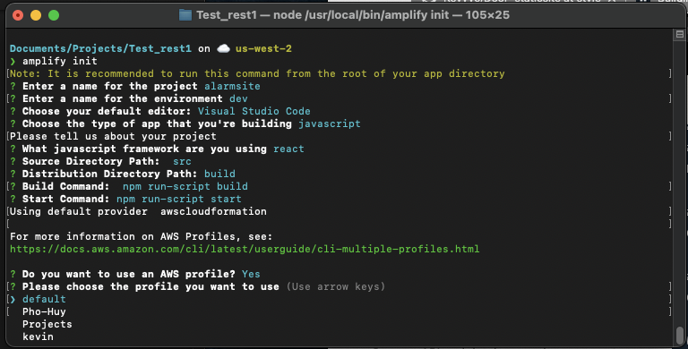
     9. If everything was successful you can just move on to Authentication setup

    </details>

4.  <details>
     <summary>Click for Authentication Setup Instruction</summary>
     
     ### Authentication Setup
     1. Since we are going to use the console to config other setting in Cognitio, we only need very simple setup
     2. Please run ```amplify add auth``` to add authentication
        + 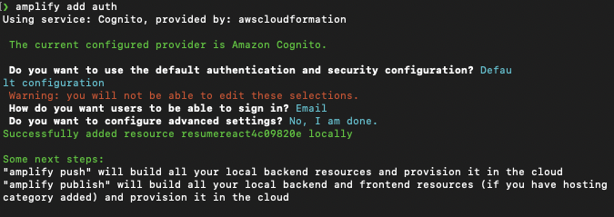
     3. Once successful please run ```amplify push```, this push all the changes to the cloud
     4. We can now test our Web app by running, ```npm start```
        + This may take awhile
        + If there are any missing libraies errors, please try to npm install them to resolve the issue
        + A sucessful lauch should look like this</br> 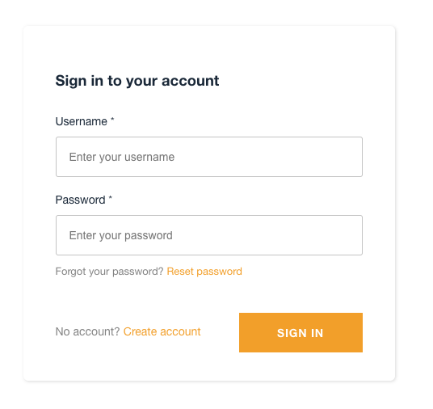
     5. Once the page has launch successful we can close that port/terminal and move onto cloud infrusture
   </details>

5.  <details>
     <summary>Click for Cloud Architecture Instruction</summary>
     
     ### Creating a poilcy
     1. Navigate to the AWS Iot Core
     2. Now go to to Secure->Policies->Create
        + 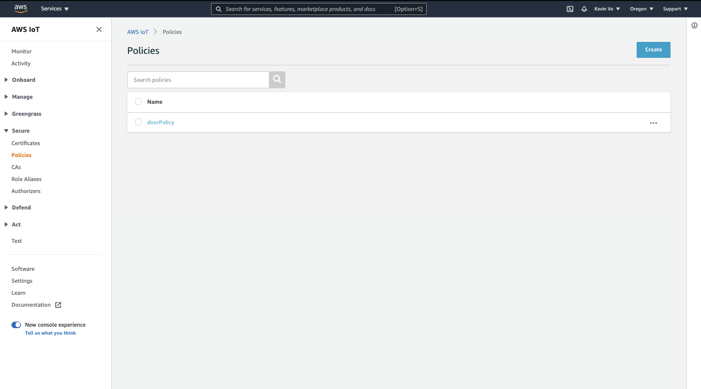
     3. Now fill out the form like this
        + 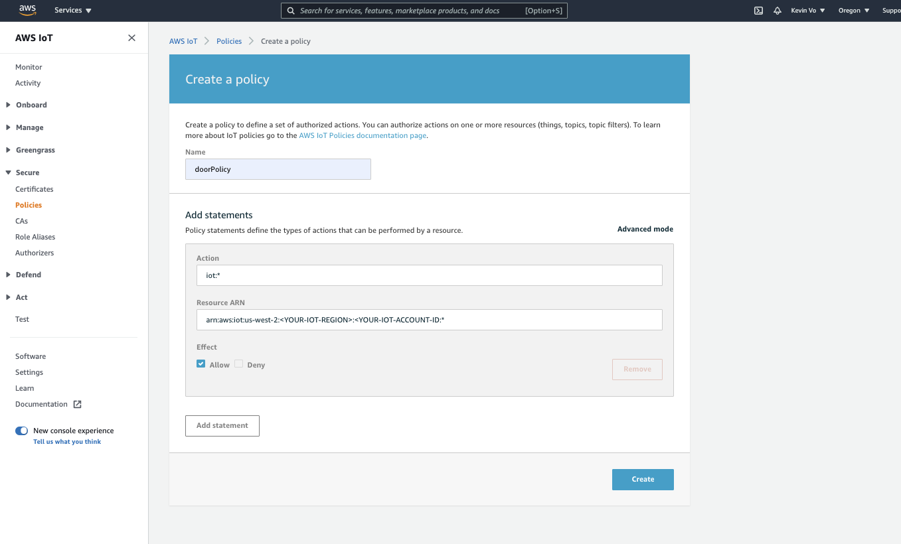
     4. Now we need to start out local server, ```npm start```
     5. Once the site has loaded, please sign up. Your E-mail should be the same as your username.
     6. Please do throught the veriying your account with you e-mail
     7. Once the account is veried, please login using the credential you just create
     8. Now open up the the console log and you should have your Cognito Idenity Id log into the Console Log. This was possbile to the line we had in out App.js in our src folder.
        + ```Auth.currentCredentials().then(creds => console.log(creds));```
     9.  Copy the ID as we will need it in the next following steps
   
     ### Resolving the websocket 
     1.  Please refer to the [guide](https://docs.aws.amazon.com/cli/latest/userguide/cli-chap-install.html) on alternate method if you don`t use Linux or mac
     2.  Run ```sudo apt-get update```
     3.  Then run ```sudo apt-get install awscli```
     4.  Finally insert the iotpolicy name you create along with the ID, ```aws iot attach-principal-policy --policy-name 'myIoTPolicy' --principal '<YOUR_COGNITO_IDENTITY_ID>'```
   
     ### Permission Settings
     1. Open the AWS Console and Navigate to CloudFormation
     2. Then look for the stack you just created. It should have 3 resources in it, which are AuthRole, UnauthRole and DepolymentBucket.
        + 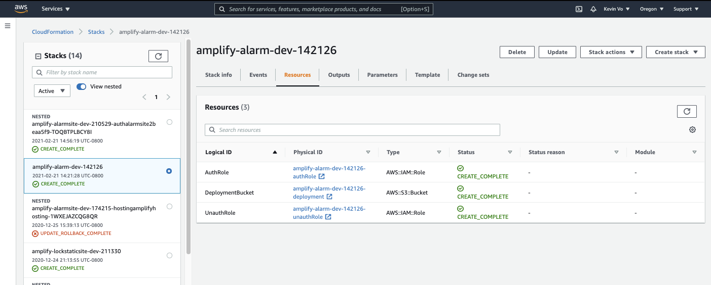
     3. Click on the authRole physical ID, this should take you IAM roles
     4. Now Click on attach policies
     5. We need to add two polices
        1. AWSIoTConfigAccess
        2. AWSIoTDataAccess
        -  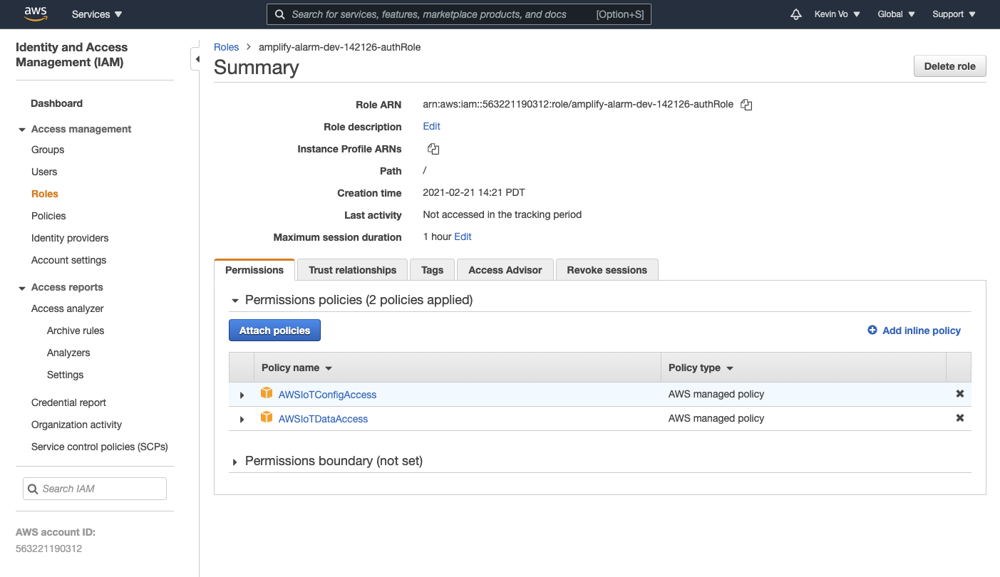 
     6. Click Attach Policy
        -  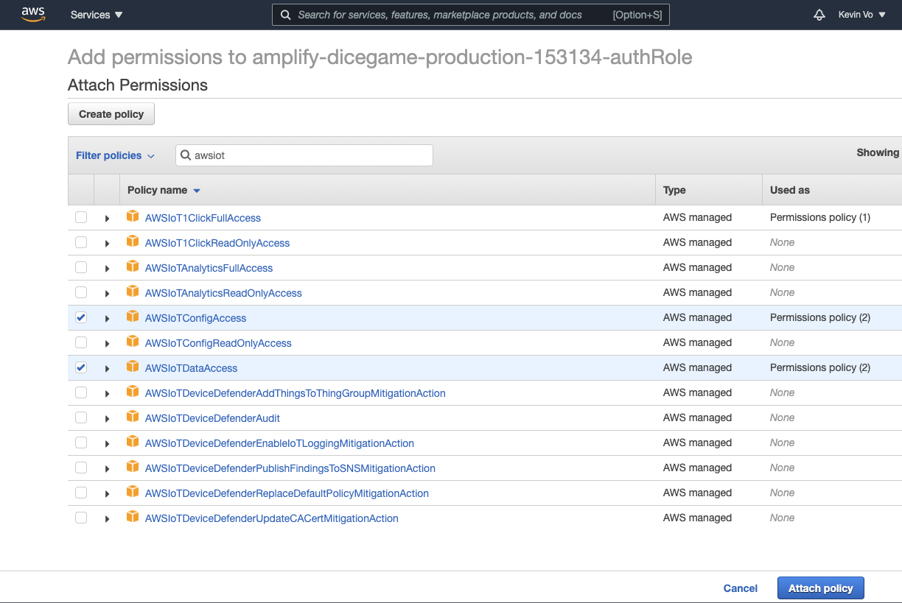

     ### Disable Sign-Up
     1. Since we are the only one that want to have access the site, we need to not have sign up open to others. Please navigate to Cognitio on the AWS console.
     2. Please follow the instruction and gif I have link below:
        1. Click on manage User Pool
        2. Select the correct Userpool 
        3. Click on the pencil icon of the box that encapules "User Sign Up allowed?"
        4. Select Only allow administartor to create users
        5. click save changes
           - 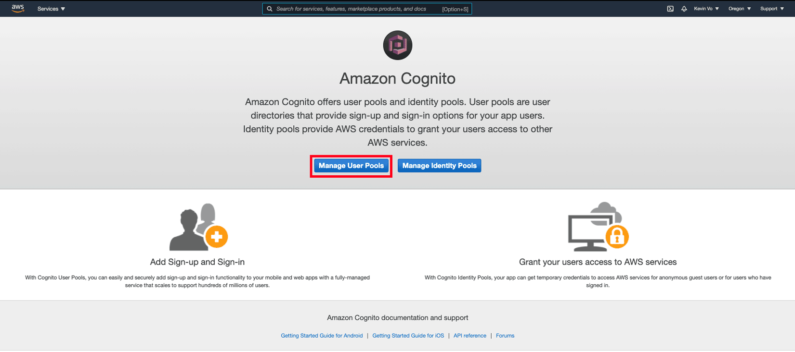
     
     ### Hosting
     1. We now need to host our react site so you can access via the internet. Open the terminal and navigate to alarmsite root folder ```cd Door_staticsite/alarmsite```
     2. Please follow the gif and instruction I have attach below:
        1. ```amplify add hosting```
        2. select the plugin module to excute: Hosting with Amplify Console (Managed hosting with custom domains, Continous depolyment)
        3. Choose a type: Manual deployment
        4. ```amplify publish``` This will push everything up to the cloud and give us public access
            - 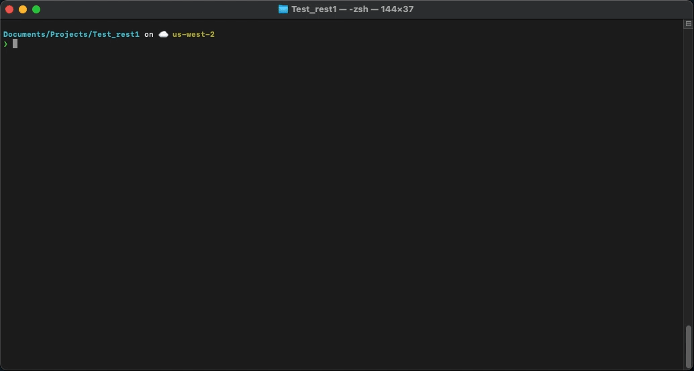
     3. If you don`t want to host on a custom domain(step 6) please return back to the [first]() repo and move onto step 5(Smart Light).
   </details>

6.  <details>
     <summary>Click for Custom Domain Instruction (OPTIONAL)</summary>
     
     ### Route 53
     1. Please navigate to Route 53 in the AWS Console
     2. Please follow the gif and instruction I have attach below:
        1. In the Register a domain, type a domain name you would like
        2. Choose a avalilble domain ending or research for a new domain
        3. add the domain to cart (WILL COST X Amount, this is only part of the project that will cost money)
        4. click continue
        5. Contact type: Person
        6. Privacy Protection: Enable
        7. Click continue
        8. Check over information, agree to the terms then click compelte order
        9. Now wait for the domain to be ready for to be use (about 15 mins)
           - 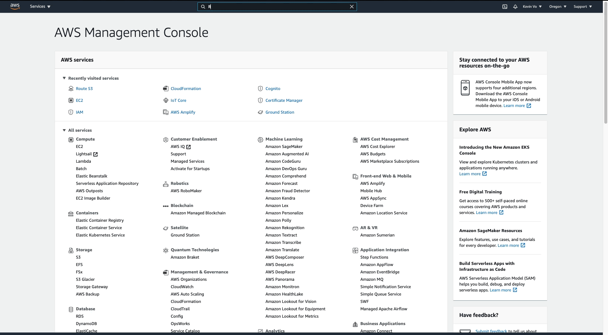

      ### Connecting it to Ampify APP
      1. Please navigate to Amplify in the AWS Console
      2. Please follow the gif and instruction below
         1. Click on the correct Amplify App
         2. Click on Domain management
         3. Click on the search bar and the custom domain we just bought should drop down from the menu
         4. select the correct domain
         5. click save
            - 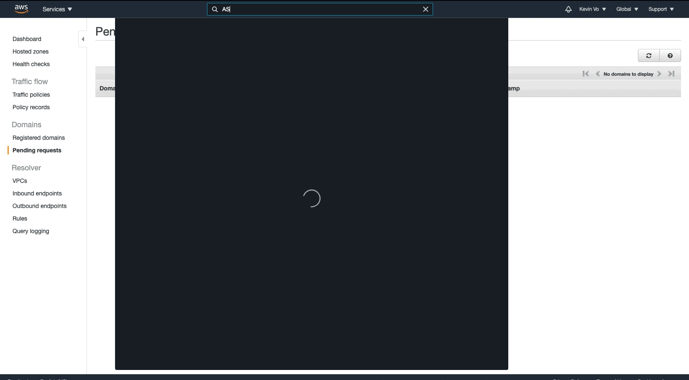
      3. Please return back to the [first]() repo and move onto step 5(Smart Light).
   </details>

## Services Used

1. AWS Amplify - Used for static hosting
2. AWS Cognitio - Used for User authenication and user management
3. AWS IOT Core - Used to do MQTT and PUbSub, also will log into a NoSQL database (DynamoDB)
4. AWS DynamoDB - Used to do store user, profile and entry data into NoSQL table
5. AWS Route53 - Used to secure custom domains
6. AWS S3 - Used to host and store serverless site


## Directory Structure
```
Door_staticsite (root)
├── Cred (Used to store credential/certificate)
│   ├── Lock_smart
│   │   ├── AmazonRootCA1.pem
│   │   ├── e90fd69537-certificate.pem.crt
│   │   ├── e90fd69537-private.pem.key
│   │   └── e90fd69537-public.pem.key
│   └── Override
│       ├── AmazonRootCA1.pem
│       ├── e36d0b7c1f-certificate.pem.crt
│       ├── e36d0b7c1f-private.pem.key
│       └── e36d0b7c1f-public.pem.key
├── LICENSE
├── Pictures
│   └── double_publish.png
├── README.md
└── alarmsite (React Folder)
    ├── README.md
    ├── amplify (AWS Amplify)
    │   ├── #current-cloud-backend
    │   │   ├── amplify-meta.json
    │   │   ├── auth
    │   │   ├── backend-config.json
    │   │   └── hosting
    │   ├── backend
    │   │   ├── amplify-meta.json
    │   │   ├── auth
    │   │   ├── awscloudformation
    │   │   ├── backend-config.json
    │   │   └── hosting
    │   └── team-provider-info.json
    ├── amplify.json
    ├── package-lock.json
    ├── package.json
    ├── src
    │   ├── App.css
    │   ├── App.js
    │   ├── App.test.js
    │   ├── aws-exports.js
    │   ├── components
    │   │   ├── ToggleSwitch.js
    │   │   ├── ToggleSwitch.scss
    │   │   └── sensorData.js
    │   ├── index.css
    │   ├── index.js
    │   ├── logo.svg
    │   ├── reportWebVitals.js
    │   └── setupTests.js
    └── yarn.lock
```
## Supporting Documentation

I want to take the time to say thank you to these fellow authors of these documentions, without them this project would not be possible. These pieces are a great learning resource if you want to give them a read.

[How to interact with AWS and push to DynamoDB](https://electronicsinnovation.com/how-to-get-raspberry-pi-to-interact-with-amazon-web-services-push-data-into-the-dynamodb/)

[Severless real-time with AWS IOT Doc 1](https://medium.com/serverlessguru/serverless-real-time-reactjs-app-aws-iot-mqtt-17d023954045)

[Bulding AWS IOT App with React.js](https://theskenengineering.com/building-a-react-js-app-with-aws-iot/)


